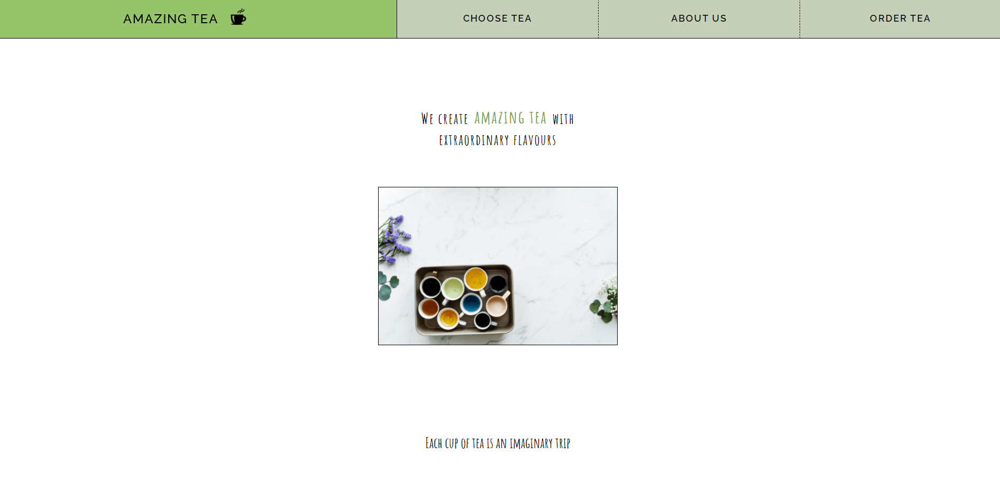
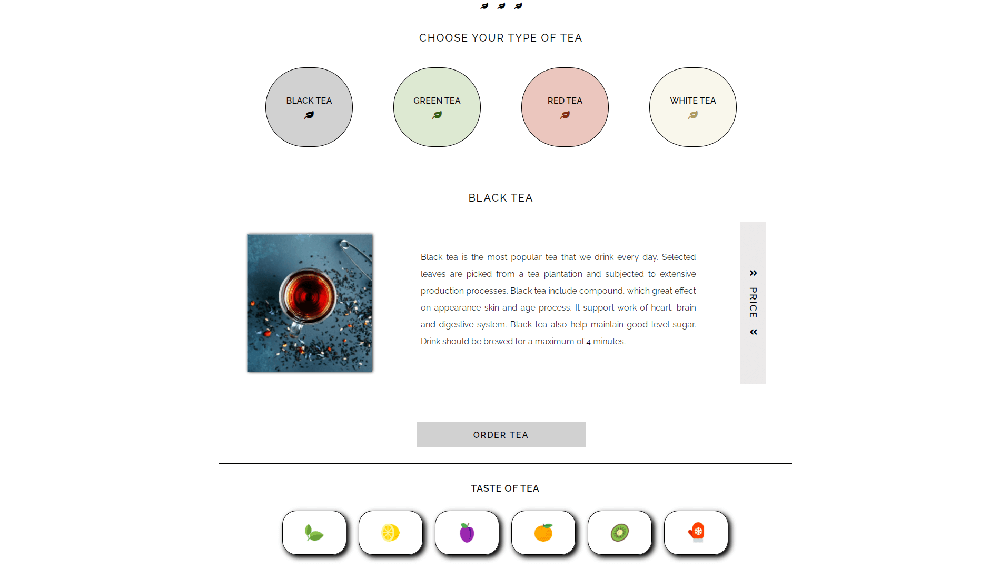
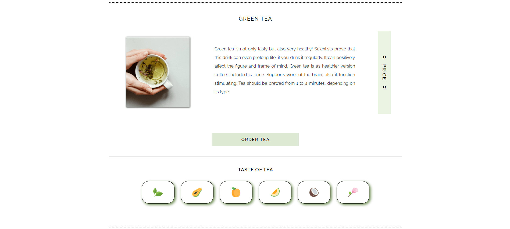
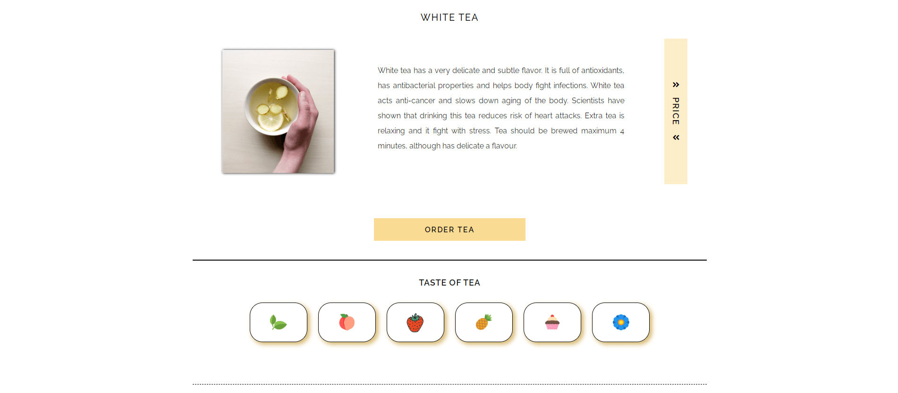
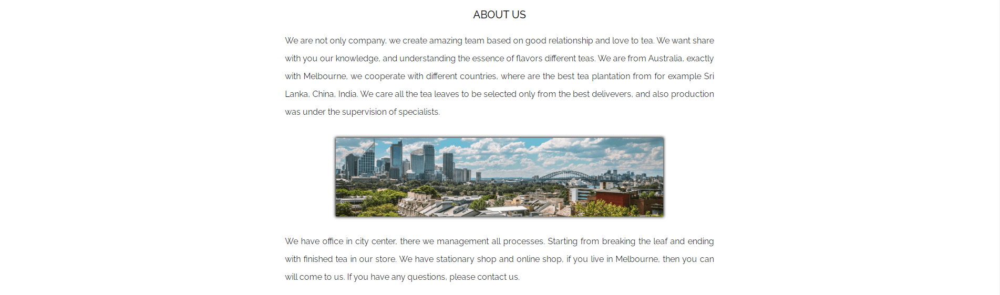
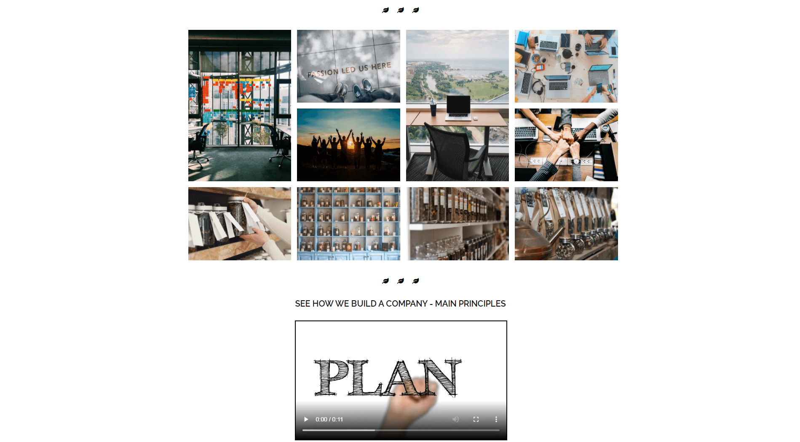
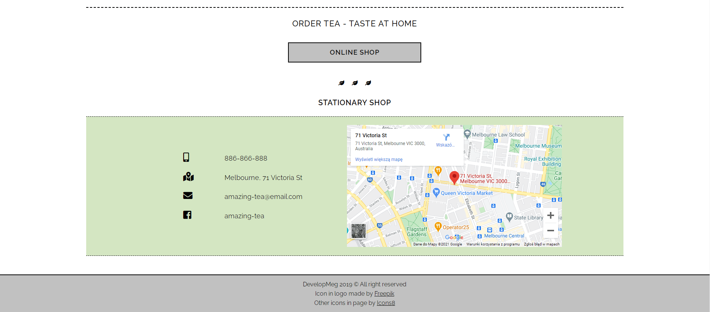

# amazing-tea

> This is my old project (which doesn`t contain aspects I learned from feedback), but shows progress of my skills

#### This is (single) page of tea company

Link: https://developmeg.github.io/amazing-tea-website/

---

## Technologies

- HTML
- SCSS
- JavaScript
- BEM
